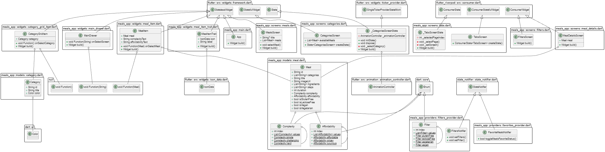

# Meal App

In this project I created a simple recipe browsing app for the Mobile Applications course at NTNU. Included below is further documentation required for this assignment.

## User Story

- As a user I'd like to be able to see all the various meal categories
- As a user I'd like to be able to choose meals from categories
- As a user I'd like to be able to choose a meal from a category
- As a user I'd like to be able to read in more detail about a specific recipe
- As a user I'd like to be able to designate specific meals as my favorites for easy viewing
- As a user I'd like to be able to remove specific meals from my favorites when I no longer like them
- As a user I'd like to be able to enable specific filters so that I only see the recipes I want to see
- As a user I'd like to be 

## App Architecture

### Main page

- App bar: Visible at the bottom of the page it provides a way for the user to access the Categories, Favorites, Surprise Me! tabs
- Categories Column: Visible in the middle of the screen is a 2 row column that displays all the categories to the user in Color
- Menu bar: Visible in the top left corner is a button that opens up a drawer from which the user can access the main page and the filters page

### Favorites page

- Recipe List: Visible in the middle of the screen are all the recipes that the user has added to their favorites. Each element within the list displays an image, Recipe title, Time to Make, Complexity Level, Cost
- App bar: Visible at the bottom of the page it provides a way for the user to access the Categories, Favorites, Surprise Me! tabs

### Surprise Me! page

- **My extra feature**
- Chooses a radom recipe from the available recipes and displays it to the user. The recipes shown obey the filters and are able to be added to the favorites by the user

### Category page

- Recipe List: Visible in the middle of the screen are all the recipes within the given category that pass the user set filters. Each element within the list displays an image, Recipe title, Time to Make, Complexity Level, Cost

### Recipe Details page

- Image: Shows an image at the top of the screen taken from a URL link
- Title: Shows the title of the recipe
- Ingredients: Shows the ingredients needed in order to cook the recipe
- Steps: Shows all the necessary steps needed to complete the recipe

## File and Folder Structure

main.dart file is the starting point of the application. The main method calls flutters runApp function in order to display the contents of the various widgets on the screen.  
The application is composed of 5 main folders. These are the; data, models, providers, screens, widgets folders    
The data folder houses the dummy_data file that contains data that is used by the application in order to populate it's categories and meals pages.    
The models folder houses the category.dart file which contains the Category class responsible for creating the various Categories to be displayed to the user. 
It also houses the meal.dart file which contains the Meal class responsible for creating the various Meals to be displayed to the user    
The providers folder contains all the various providers that are used in the application in order to transfer states between various Widgets and Screens more easily. These files also contain the logic behind setting filters as well as adding and removing favorite meals.    

The screens folder houses all the various screens that the user navigates between while using the application  
The categories.dart file is responsible for displaying the various categories to the user  
The filters.dart file is responsible for displaying all the Switch buttons as well as relaying the data to the filters_provider  
The meal_details.dart file is responsible for allowing the user to have a more detailed look at each meal as well as for allowing the user to add individual meals to their favorites  
The meals.dart file is responsible for displaying all the meals within a given category to the user. The meals display obey the filters applied by the user  
The tabs.dart file functions as a main page, responsible for allowing the user to navigate between all these various screens   

The widgets folder contains all the various widgets that are used in the application  

## Class diagram

## Peer Review

I have included my findings on how I will be able to learn from my peer review partner in a separate .pdf file which I have attached to the blackboard delivery.